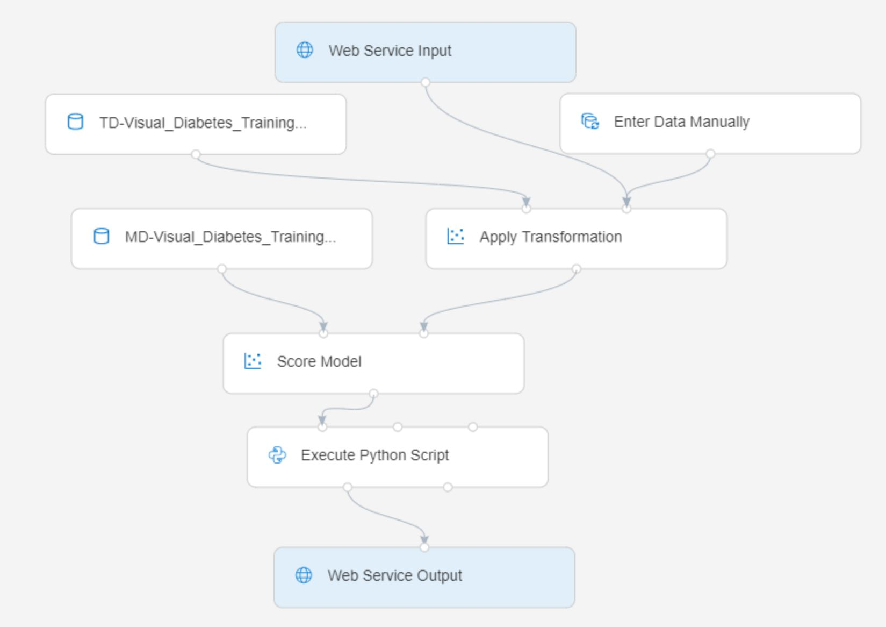

# Lab 2B: Deploying a Service with the Azure ML Designer

Now that you have a trained model, you can take the training pipeline and use it to create an inference pipeline for scoring new data.

> **Note**: Azure Machine Learning Designer is in *preview* at the time of writing. You may experience some unexpected errors.

## Before You Start

Before you start this lab, ensure that you have completed [Lab 1A](Lab01A.md) and [Lab 1B](Lab01B.md), which include tasks to create the Azure Machine Learning workspace and other resources used in this lab. You must also complete [Lab 2A](Lab02A.md), which includes tasks to create the Designer training pipeline used in this lab.

## Task 1: Prepare Inference Compute

In this lab, you will publish an inference pipeline as a containerized service in an Azure Kubernetes Service (AKS) cluster. An AKS cluster can take some time to initialize, so you'll start the process before preparing your inference pipeline.

1. In [Azure Machine Learning studio](https://ml.azure.com), on the **Compute** page for your workspace, review the existing compute targets under each tab. These should include:
    * **Compute Instances**: The compute instance you created in a previous lab.
    * **Compute Clusters**: The **aml-cluster** compute target you created in a previous lab.
    * **Inference Clusters**: None (yet!)
    * **Attached Compute**: None (this is where you could attach a virtual machine or Databricks cluster that exists outside of your workspace)

2. In the **Compute Instances** tab, if your compute instance is not already running, start it - you will use it later in this lab.

3. On the **Inference Clusters** tab, add a new cluster with the following settings:
    * **Compute name**: *enter a unique name*
    * **Kubernetes Service**: Create new
    * **Region**: *A region <u>other than the one where your workspace is provisioned</u>*
    * **Virtual Machine size**: Standard_DS2_v2 (*Use the filter to find this in the list*)
    * **Cluster purpose**: Dev-test
    * **Number of nodes**: 2
    * **Network configuration**: Basic
    * **Enable SSL configuration**: Unselected

    > **Note**: Your Azure subscription may have restrictions on the number of cores you can provision, with additional regional restrictions. In this lab, it's important to create your AKS cluster in a different regions from your other compute, and to use the **Dev-test** cluster purpose (to allow your endpoint to be deployed on a cluster with fewer than the 12 core minimum for production clusters) and the **Standard_DS2_v2** virtual machine size (which includes two cores per node, so that your two nodes use only four cores).

4. Verify that the compute target is in the *Creating* state, and proceed to the next task. Returning periodically to refresh this page and verify that the cluster is being created.

    > **Note**: Creating an AKS cluster can take a significant amount of time. If an error occurs during creation, delete the failed cluster and try again using a different region.

## Task 2: Create an Inference Pipeline

While the inference compute is being provisioned, you can prepare the inference pipeline for deployment.

1. On the **Designer** page, open the **Visual Diabetes Training** pipeline you created in the previous lab.
2. In the **Create inference pipeline** drop-down list, click **Real-time inference pipeline**. After a few seconds, a new version of your pipeline named **Visual Diabetes Training-real time inference** will be opened.
3. Rename the new pipeline to **Predict Diabetes**, and then review the new pipeline. Note that some of the transformations and training steps have been encapsulated in this pipeline so that the statistics from your training data will be used to normalize any new data values, and the trained model will be used to score the new data.
4. The inference pipeline assumes that new data will match the schema of the original training data, so the **diabetes dataset** module from the training pipeline is included. However, this input data includes the **Diabetic** label that the model predicts, which is unintuitive to include in new patient data for which a diabetes prediction has not yet been made. Delete this module and replace it with an **Enter Data Manually** module from the **Data Input and Output** section, connected to the same **dataset** input of the **Apply Transformation** module as the **Web Service Input**. Then modify the settings of the **Enter Data Manually** module to use the following CSV input, which includes feature values without labels for three new patient observations:

    ```CSV
    PatientID,Pregnancies,PlasmaGlucose,DiastolicBloodPressure,TricepsThickness,SerumInsulin,BMI,DiabetesPedigree,Age
    1882185,9,104,51,7,24,27.36983156,1.350472047,43
    1662484,6,73,61,35,24,18.74367404,1.074147566,75
    1228510,4,115,50,29,243,34.69215364,0.741159926,59
    ```

5. The inference pipeline includes the **Evaluate Model** module, which is not useful when predicting from new data, so delete this module.
6. The output from the **Score Model** module includes all of the input features as well as the predicted label and probability score. To limit the output to only the prediction and probability, delete the connection between the **Score Model** module and the **Web Service Output**, add an **Execute Python Script** module from the **Python Language** section, connect the output from the **Score Model** module to the **Dataset1** (left-most) input of the **Execute Python Script**, and connect the output of the **Execute Python Script** module to the **Web Service Output**. Then modify the settings of the **Execute Python Script** module to use the following code (replacing all existing code):

    ```Python
    import pandas as pd

    def azureml_main(dataframe1 = None, dataframe2 = None):

        scored_results = dataframe1[['PatientID', 'Scored Labels', 'Scored Probabilities']]
        scored_results.rename(columns={'Scored Labels':'DiabetesPrediction',
                                       'Scored Probabilities':'Probability'},
                              inplace=True)
        return scored_results
    ```

7. Verify that your pipeline looks similar to the following:

    

8. Submit the pipeline as a new experiment named **predict-diabetes** on the **aml-cluster** compute target you used for training. This may take a while!

## Task 3: Publish a Web Service

Now you have an inference pipeline for real-time inferencing, which you can publish as a web service for client applications to use.

1. Return to the **Compute** page and on the **Inference Compute** tab, refresh the view and verify that your inference cluster has been created. If not, wait for it to be created. This may take quite a bit of time.
2. Switch back to the **Designer** tab and reopen your **Predict Diabetes** inference pipeline. If it has not yet finished running, await it's completion. Then visualize the **Result dataset** output of the **Execute Python Script** module to see the predicted labels and probabilities for the three patient observations in the input data.
3. At the top right, click **Deploy**, and set up a new real-time endpoint named **predict-diabetes** on the inference cluster you created.
4. Wait for the web service to be deployed - this can take several minutes. The deployment status is shown at the top left of the designer interface.

    > **Tip**: While you're waiting for your service to be deployed, why not spend some time reviewing the Azure Machine Learning Designer documentation at [https://docs.microsoft.com/azure/machine-learning/service/concept-designer](https://docs.microsoft.com/azure/machine-learning/service/concept-designer)?

## Task 4: Test the Web Service

Now you can test your deployed service from a client application - in this case, you'll use a notebook in your Notebook VM.

1. On the **Endpoints** page, open the **predict-diabetes** real-time endpoint.
2. When the **predict-diabetes** endpoint opens, on the **Consume** tab, note the **REST endpoint** and **Primary key** values.
3. In another browser tab, open the **Compute** page for your workspace in Azure Machine Learning studio. If your compute instance is not yet running, wait for it to start. Then click its **Jupyter** link.
4. In Jupyter, in the **Users/DP100** folder, open **02B - Using the Visual Designer.ipynb**.
5. In the notebook, replace the **ENDPOINT** and **PRIMARY_KEY** placeholders with the values for your service, which you can copy from the **Consume** tab on the page for your endpoint.
6. Run the code cell and view the output returned by your web service.
7. When you have finished running the code in the notebook, on the **File** menu, click **Close and Halt** to close it and shut down its Python kernel. Then close all Jupyter browser tabs.

## Task 5: Delete the Web Service and Stop Compute

The web service is hosted in a Kubernetes cluster. If you don't intend to experiment with it further, you should delete the endpoint and the cluster to avoid accruing unnecessary Azure charges. You should also stop other compute resources until you need them again.

1. In [Azure Machine Learning studio](https://ml.azure.com), on the **Endpoints** tab, select the **predict-diabetes** endpoint. Then click the **Delete** (&#128465;) button and confirm that you want to delete the endpoint.
2. On the **Compute** page, on the **Inference clusters** tab, select the select your inference cluster. Then click the **Delete** (&#128465;) button and confirm that you want to delete the compute target.
3. On the **Compute** page, on the **Compute clusters** tab, edit your compute cluster and reset the **minimum number of nodes** to 0.
4. If you're finished working with Azure Machine Learning for the day, on the **Compute Instances** tab, select your compute instance and click **Stop** to shut it down. Otherwise, leave it running for the next lab.
